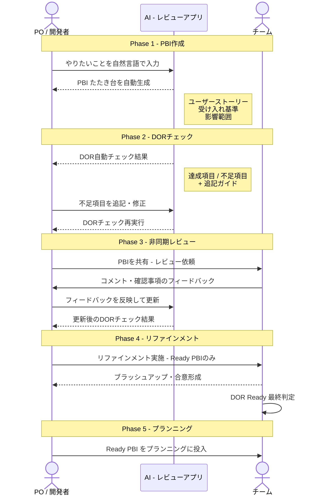
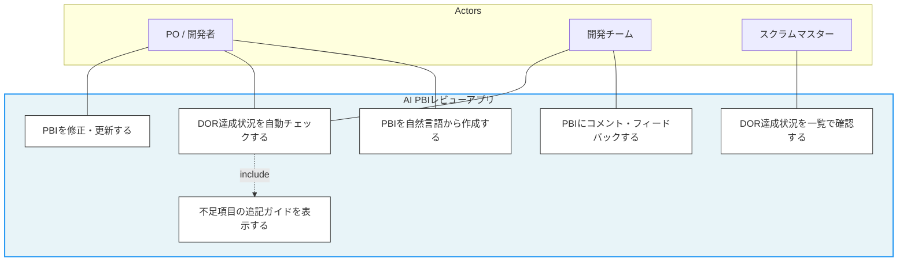
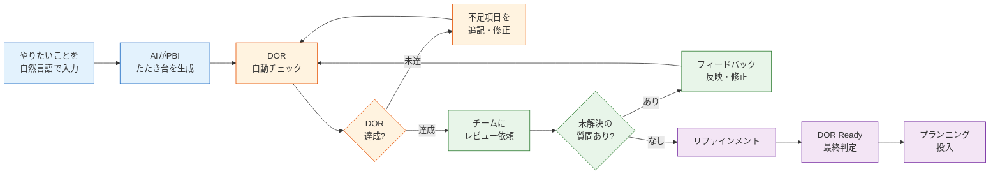

# PBIレビューアプリ ユースケース図・フロー図

## 1. シーケンス図（処理の流れ）

## 2. ユースケース図

## 3. 全体フロー図

### フロー図の色分け

| 色 | フェーズ | 内容 |
|----|---------|------|
| 青 | PBI作成 | 自然言語入力 → AI自動生成 |
| 橙 | DORチェック | 自動判定 → 不足項目の修正ループ |
| 緑 | チームレビュー | 非同期フィードバック → 反映 |
| 紫 | リファインメント・プランニング | Ready判定 → スプリント投入 |
