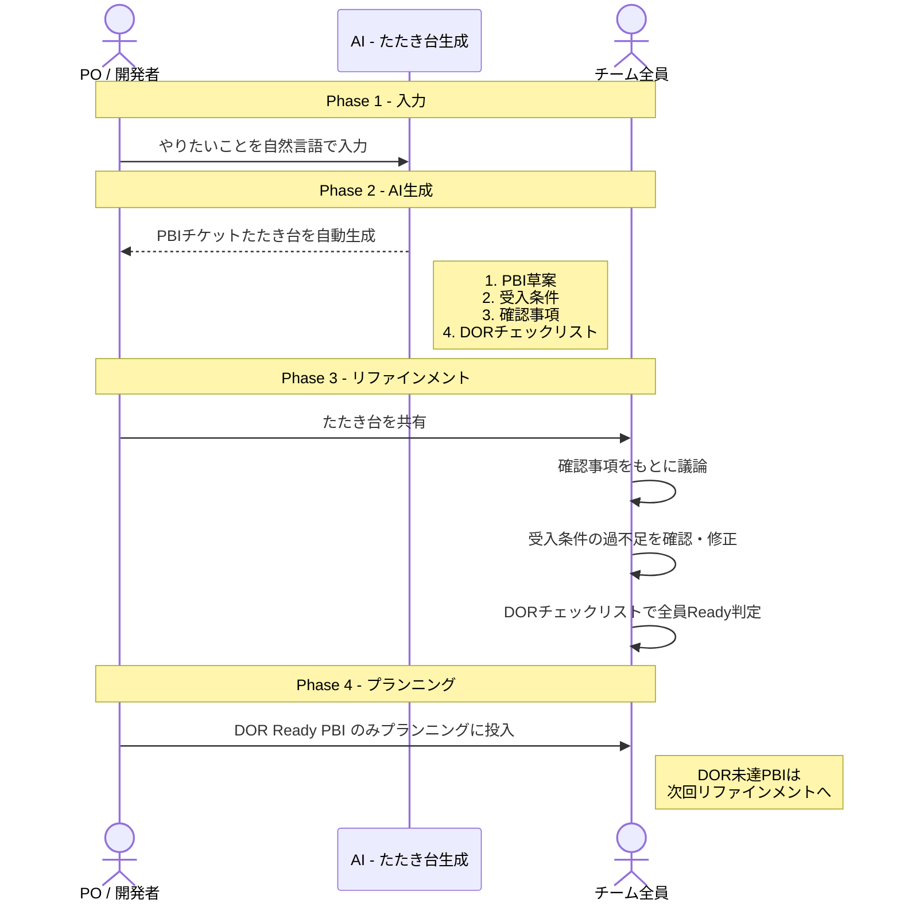
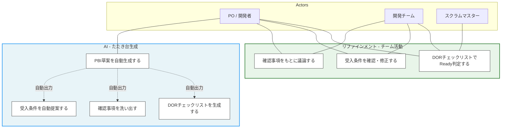
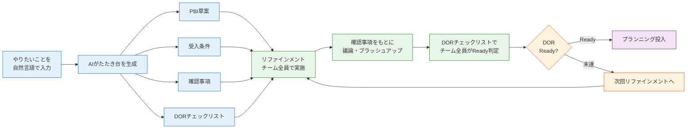

# PBIレビューアプリ ユースケース図・フロー図

## 1. シーケンス図（処理の流れ）

## 2. ユースケース図

## 3. 全体フロー図

### フロー図の色分け

| 色 | フェーズ | 内容 |
|----|---------|------|
| 青 | AI生成 | 自然言語入力 → たたき台自動生成 |
| 緑 | リファインメント | チーム全員で議論・ブラッシュアップ・DOR判定 |
| 橙 | 判定 | Ready / 未達の分岐 |
| 紫 | プランニング | Ready PBIのみ投入 |

### AIとチームの役割分担

| 役割 | AI | チーム |
|------|-----|--------|
| PBI草案作成 | たたき台を生成 | - |
| 受入条件 | テスト可能な形で提案 | 過不足を確認・修正 |
| 確認事項 | 不明点・考慮漏れを洗い出し | 議論の材料として活用 |
| DORチェックリスト | テンプレートを生成 | チーム全員でReady判定を実施 |
